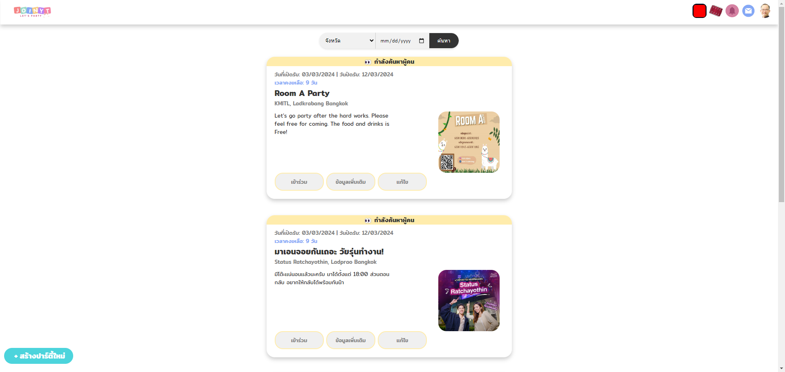

# KMITL-WebApplication-Development-Projects-2D

<h3>JoinTy</h3>

a Project that required using only HTML, CSS and JavaScript based on MVC Pattern on ASP.NET Core MVC.

    
     
    
    
    

JoinTy was inspired by an application called <a href="https://www.wegowhere.com/" >WeGoWhere</a> in UX/UI and some native systems.

<h3>Let's go look at each pages!</h3>

Sign In Page

Home Page 

Create Party Form Page

User Profile Page

Chat System Page

Unfortunately, one week is not enough time to complete the chat system and fix various bugs. We could only create a mockup for now.

Presentation slides and more details
<a href="https://www.canva.com/design/DAF_YbQWv68/47nD6clRdHF9Y4i2VAhDsQ/edit?fbclid=IwZXh0bgNhZW0CMTAAAR1LrVmVxZ6fDxXSsVXRBx6LZktN9g_aIku46ZBAInGbJQpCJigy5db6nz4_aem_9GTiNMujkE6nVcdv66uDPw">Click Here!</a>